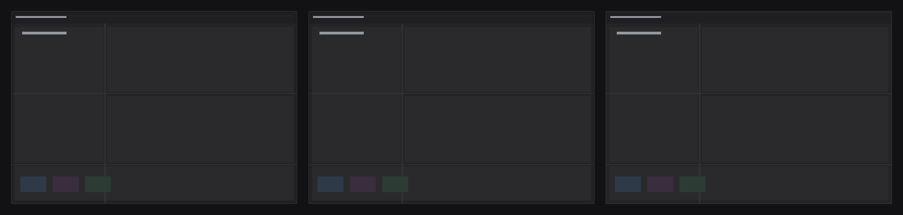

# Azy Skin

A lightweight Windows utility that makes Adobe Premiere Pro look cleaner, darker
and slightly glassy — **without touching Premiere**.

Premiere Pro keeps doing exactly what it did before. Azy Skin is not a plugin, not
a panel, not an overlay, and not an editing tool. It is a native Win32 companion
that sits in the system tray, notices when Premiere starts, and applies a
restrained dark treatment to the *window* Premiere already draws — then gets out
of the way.

```
“This is still Premiere Pro, but the interface looks more polished.”
```

---

## What it is (and is not)

| | |
|---|---|
| **Is** | A ~550 KB native C++/Win32 application, event-driven, no dependencies, no installer requirements, no Adobe integration |
| **Is** | A dark charcoal + subtle glass treatment applied through documented Windows window composition |
| **Is not** | A UXP / CEP / ExtendScript extension, a Premiere API consumer, or a plugin of any kind |
| **Is not** | Process injection, memory patching, file patching, resource replacement, or hooking of Premiere's internals |
| **Is not** | An alternative UI, a replacement timeline, a second toolbar, or a screen-covering overlay. The whole-window overlay is one solid constant-alpha layer over *Premiere's own window* — no bitmap, no per-pixel surface, nothing that covers the desktop |
| **Never** | Takes focus, eats a click, a key, a scroll, a drag, or a shortcut |
| **Never** | Animates anything — no transitions, no glow, no particles, no FPS-dependent work |

Azy Skin does not know or care where Premiere is installed. It never opens an
Adobe file. If Azy Skin is closed, paused or crashed, Premiere is completely
unaffected — it never becomes a dependency.

---

## How it works in one paragraph

Windows gives an external process a small number of *supported* ways to restyle
another application's window, and Azy Skin uses only those. It identifies the
Premiere process from the Windows process list (matched on the executable
*name*, never a hardcoded path) and reads its version from the executable's
version resource. It learns about everything else from Windows notifications:
process creation/deletion, window creation/destruction, moves, resizes,
minimisation, foreground changes, DPI and display changes. When something
actually changes, it applies the theme through two mechanisms — documented DWM
window-composition attributes on Premiere's own top-level frame, and one
click-through, non-activating layered window that carries a 1px hairline border
and a soft inner shadow — and then does nothing at all until the next event.

Detailed design: [`docs/ARCHITECTURE.md`](docs/ARCHITECTURE.md).
Every technique and why it is safe: [`docs/TECHNIQUES.md`](docs/TECHNIQUES.md).

---

## Installing

1. Run `AzySkin-1.0.2-setup.exe`.
2. Choose whether Azy Skin should start with Windows and whether it should skin
   Premiere automatically (both recommended).
3. Start Premiere Pro.

Azy Skin appears in the system tray. There is no main window, no taskbar button
and no Alt+Tab entry — that is deliberate.

**Requirements** — Windows 10 version 1809 (build 17763) or newer, 64-bit.
Premiere Pro 2024, 2025 and 2026 get the full treatment; other builds get a
conservative version of it ([details](docs/COMPATIBILITY.md)).

### Uninstalling

Settings → Apps → Azy Skin → Uninstall (or the Start menu entry). The uninstaller
removes Azy's files, its `%LOCALAPPDATA%\Azy Skin` folder and its startup entry.
It never touches Adobe folders, Premiere preferences, projects or plugins —
Premiere simply goes back to its original look.

---

## Using it

Everything lives in the tray icon (single left click toggles the skin on/off):

```
Azy Skin: Azy Dark Glass, full - active | Premiere Pro: Premiere Pro 2025 25.6.0.58
────────────────────────────────────────────────────────────────────────────────
Skin Enabled                                    ✓
Theme                ▸  Azy Dark Glass / Azy Dark / Original
Settings…                                          (double-click the icon)
Start with Windows
Suspend Skin
Reload Configuration                               (after hand-editing settings.ini)
Open Log File
Restart as Administrator                           (only when Premiere runs elevated)
Exit
```

**ON / OFF is instant.** With the skin off, Premiere's window frame is restored to
the exact values DWM had before Azy touched it, and Azy's own surface is hidden
immediately. No Premiere restart is ever needed.

### Settings window

| Group | Options |
|---|---|
| **Skin** | Enable skin · Start with Windows · Apply automatically to Premiere Pro |
| **Appearance** | Theme · Glass intensity · Border intensity · Corner radius · Shadow intensity · Overall darkness |
| **Performance** | Performance mode · Suspend while minimized · Suspend while inactive |
| **Advanced** | Experimental visual features · Re-enable features after Safe Mode · Reset configuration · Open log file |

Every change applies live — there is no OK/Apply step. Settings are stored in
`%LOCALAPPDATA%\Azy Skin\settings.ini`, which is plain INI and safe to edit by
hand (Azy notices and reloads it). See [`docs/SETTINGS.md`](docs/SETTINGS.md).

### If you cannot see the skin

The status area of the settings window reports what Azy is actually doing, on the
machine it is doing it on — including the version that is running:

```
Azy Skin 1.2.3 - window 'Premiere Pro' 1920x1040 at (0,0) | maximized | screen (0,0)-(1920,1080) | 100%
Ring 12px at (0,0)-(1920,1040) | brightest pixel 199/255 | in front of Premiere: yes
Overlay: 30% tint over the whole window
```

0. **Press *Check visibility*** (next to *Open log file*). Azy hides its
   layers for a single frame, reads the same pixels back from the desktop, and
   tells you what actually changed — the difference between "every Windows call
   returned success" and "you can see it". Copy the text with Ctrl+C if you report
   a problem.
1. **Check the version on the first line** — it is the build you installed.
2. `Ring: not on screen - ...` names the reason (nothing attached yet, the strips
   could not be placed in front of Premiere, an empty bitmap).
3. `brightest pixel 0/255` would mean the ring rendered nothing; `in front of
   Premiere: no` means something is stacked above the strips.
4. If both lines look right, the ring *is* on screen: it is drawn just inside the
   rectangle named in the second line. The default look is deliberately subtle —
   raise **Border intensity** and **Overall darkness** to make it unmistakable, then
   dial back. On a maximized window the ring follows the monitor's work area.
5. If Premiere Pro runs as administrator, start Azy Skin as administrator too:
   Windows does not allow a lower-integrity process to draw above a higher-integrity
   one, and Azy says so in the panel and in a tray notification.

The same facts are in `%LOCALAPPDATA%\Azy Skin\azy.log` (Settings → *Open log
file*), where `docs/TESTING.md` explains every field.

---

## The look

**Azy Dark Glass** (default) — a near-black charcoal frame with a slightly
lighter panel wash, a 1px hairline border at 4–13% white, a barely visible top
highlight, a soft low-opacity inner shadow on the window's outer band, and around
8px corner radius where Windows supports it. Surfaces stay 78–94% opaque, so what
shows through is a hint of context, not a see-through panel.

Darker, more saturated or more translucent than that is not the goal:
`premium dark glass`, not `RGB gaming UI`. The defaults are intentionally
restrained; the sliders exist for people who want to push them.

The other two themes are **Azy Dark** (the same treatment, fully opaque — no
translucency anywhere) and **Original** (Azy applies nothing at all).

On top of that edge treatment, **the overlay covers the whole window**: one
translucent charcoal layer over everything Premiere draws, so the application reads
as skinned rather than outlined. It is a single window composited with a constant
alpha — no bitmap, no per-pixel work, no animation — and it is adjustable
(*Cover the whole window* + *Overlay strength* in Settings, 0% = edge only). Because
it covers the video monitors as well, it is the first thing to turn down if you
grade footage: the edge vignette frames the workspace without touching the picture.



*Left: Azy Dark Glass (default). Middle: Azy Dark (opaque). Right: Performance
mode. Above, a schematic of the edge treatment; below, the actual corner at 4×
zoom — a 1px hairline on the frame edge, a 1px raised bezel inside it, then a soft
falloff inward. Reproduced from the renderer's own maths by
`tools/preview_render.py`, so it can be reviewed without a Windows machine.*

Why a *lighter* line inside the frame edge rather than a darker one: a purely dark
edge treatment is invisible over Premiere's own near-black panels. The bezel is
what makes the boundary read as a boundary, at 5–17% white — separation, not an
outline.

---

## Performance

Azy Skin is built around *not* doing work:

* **Idle with Premiere open: 0% CPU.** No polling loop, no rendering, no work
  driven by a clock. The 1-second timer is only a safety net for a notification
  Windows failed to deliver; its normal path builds the visual key, compares it
  against the last one and returns without drawing anything.
* **Nothing happens without an event.** Window moves, resizes, minimise,
  foreground changes, DPI changes, display changes, Premiere start/stop — all
  arrive as Windows notifications. A static window produces no DWM calls, no
  repaints and no monitoring.
* **Memory: typically 6–10 MB.** No Electron, no Chromium, no scripting engine,
  no animation or UI framework. Just Win32, GDI+ for one ring bitmap, and the C++
  runtime.
* **One paint per change, never per frame.** Azy's ring is four thin cached
  strips (top/bottom/left/right) handed to the compositor with
  `UpdateLayeredWindow`; they are only regenerated when the geometry, DPI or
  appearance actually changes. Splitting the ring keeps its bitmaps at ~280 KB on a
  1080p window (1.0 MB at 4K/200%) instead of a 33 MB window-sized layer at 4K.
* **While suspended, it is invisible.** Minimised, inactive (opt-in), dragged,
  hidden or unskinned: the surface is *hidden*, the DWM work is skipped, and no
  resources are held.

**Performance mode** goes further: flat static colours, no shadow, no
translucency, no compaction of anything expensive — designed to be the default on
lower-end machines.

Measured numbers and the method: [`docs/PERFORMANCE.md`](docs/PERFORMANCE.md).

---

## Safety and stability

| Property | How it is guaranteed |
|---|---|
| Never steals focus | Azy's surface window is created with `WS_EX_NOACTIVATE`; Azy has no focusable window at all while idle |
| Never eats input | `WS_EX_TRANSPARENT` (hit-test pass-through) + `WS_EX_TOOLWINDOW`; verified at runtime, and the contract is re-checked on every surface creation |
| Never blocks the timeline | The surface is never larger than Premiere's own visible frame, and it is hidden the instant a move/resize loop starts |
| Never breaks on a new Premiere | Version-aware policy; unknown or newer builds get a conservative treatment instead of guessing |
| Never retries forever | Repeated failures trip **Safe Mode**: dark frame only, no composition surfaces, with a one-line explanation and a manual way back |
| Never leaves Premiere modified | Every DWM attribute is read first and restored on OFF, on suspend, on Premiere exit and on Azy exit |
| Never a dependency | Azy can be closed, paused or killed mid-session; Premiere is unaffected in every case |

The full stability and compatibility reasoning, including what is deliberately
*not* attempted and why: [`docs/LIMITATIONS.md`](docs/LIMITATIONS.md).

---

## Building from source

```powershell
# Windows (MSVC or MinGW + Windows SDK)
powershell -ExecutionPolicy Bypass -File scripts\build-windows.ps1

# then run the core unit tests
ctest --test-dir build -C Release --output-on-failure
```

```bash
# Linux/macOS: run the core tests natively and cross-compile the Windows app
# (uses the clang shipped with the `ziglang` pip package - see docs/BUILDING.md)
./scripts/verify.sh
```

Packaging: `powershell -File scripts\package.ps1` (needs Inno Setup 6) produces
`dist\AzySkin-1.2.3-setup.exe`.

Full instructions, including what the cross build can and cannot verify:
[`docs/BUILDING.md`](docs/BUILDING.md).

---

## Repository layout

```
include/azy/core/      portable logic: version, product, compat, theme, settings, log
include/azy/win32/     Win32 layer headers (detect, os, performance, skin, ui, watch)
include/azy/app/       application layer headers
src/                   implementations, mirroring the header tree
tests/core_tests.cpp   unit tests for the portable core (no Windows needed)
packaging/             Inno Setup script + installer text
resources/             application manifest, icon, version resource
tools/make_icon.py     regenerates resources/azy_skin.ico
tools/check-includes.py  guards against include-hygiene breakage on MSVC
tools/res_to_coff.py     turns the cross build's .res into a linkable object
tools/inspect-pe.py      verifies the built executable and its resources
cmake/                 cross-compile toolchain file
scripts/               build, package and verification scripts
docs/                  architecture, techniques, compatibility, performance, testing
```

---

## Documentation

| Document | Contents |
|---|---|
| [`docs/HOW_IT_WORKS.md`](docs/HOW_IT_WORKS.md) | The whole mechanism in one page: detection, the three visual layers, click-through, stacking, teardown |
| [`docs/AZYSKIN_AUDIT.md`](docs/AZYSKIN_AUDIT.md) | The full implementation audit: what was found, what was fixed, what remains, and the readiness verdict |
| [`docs/ARCHITECTURE_REVIEW.md`](docs/ARCHITECTURE_REVIEW.md) | Second-pass review: is this the right architecture, what alternatives were rejected and why |
| [`docs/DEEP_BUG_REPORT.md`](docs/DEEP_BUG_REPORT.md) | Every defect the deep review found, with root cause, impact, fix and how it was checked |
| [`docs/RUNTIME_RISK.md`](docs/RUNTIME_RISK.md) | What cannot be verified without Premiere, the runtime simulation, and how to close the list in one session |
| [`docs/VERIFICATION.md`](docs/VERIFICATION.md) | Per feature: verified by a machine, only compiled, or unverified - and with what evidence |
| [`docs/KNOWN_LIMITATIONS.md`](docs/KNOWN_LIMITATIONS.md) | Everything Azy cannot do, does not do yet, or has not been proven to do |
| [`docs/ARCHITECTURE.md`](docs/ARCHITECTURE.md) | Modules, data flow, message routing, threading, lifecycle |
| [`docs/TECHNIQUES.md`](docs/TECHNIQUES.md) | Every Windows technique used, the safety checklist for each, and the ones deliberately rejected |
| [`docs/COMPATIBILITY.md`](docs/COMPATIBILITY.md) | Premiere versions, Windows builds, DPI and multi-monitor behaviour, safe fallbacks |
| [`docs/LIMITATIONS.md`](docs/LIMITATIONS.md) | What cannot be restyled from outside Premiere, and why Azy refuses to force it |
| [`docs/FEASIBILITY.md`](docs/FEASIBILITY.md) | What Premiere's UI actually is, region by region, and which visual techniques reach it |
| [`docs/PROGRESS.md`](docs/PROGRESS.md) · [`docs/progress.html`](docs/progress.html) | Where the implementation stands against the full specification, with per-phase estimates |
| [`docs/PERFORMANCE.md`](docs/PERFORMANCE.md) | CPU/memory/GPU budget, what is done to meet it, how to measure it |
| [`docs/TESTING.md`](docs/TESTING.md) | The manual test matrix (window states, DPI, multi-monitor, editing interactions, failure cases) |
| [`docs/SETTINGS.md`](docs/SETTINGS.md) | Every configuration key, its range and its default |
| [`docs/BUILDING.md`](docs/BUILDING.md) | Toolchains, cross-compilation, packaging, CI |
| [`CHANGELOG.md`](CHANGELOG.md) | Release history |

---

## Principles

1. **Make Premiere look better, not work differently.** Functionality is never
   touched — no shortcuts, no panels, no workflows, no editing behaviour.
2. **Performance first.** If a visual idea costs CPU while nothing is happening,
   it does not ship.
3. **Least invasive technique that achieves the effect.** Documented Windows
   composition, not clever tricks.
4. **Static and subtle.** No animation is a feature, not a limitation.
5. **Graceful degradation.** Anything that cannot be done safely is skipped,
   reported once, and the skin falls back — never escalated.

---

## Legal

MIT licensed ([`LICENSE`](LICENSE)). Azy Skin is an independent utility, not
affiliated with or endorsed by Adobe. Adobe and Adobe Premiere Pro are trademarks
of Adobe Inc. Azy Skin contains, modifies and redistributes no Adobe code,
resource or file.
