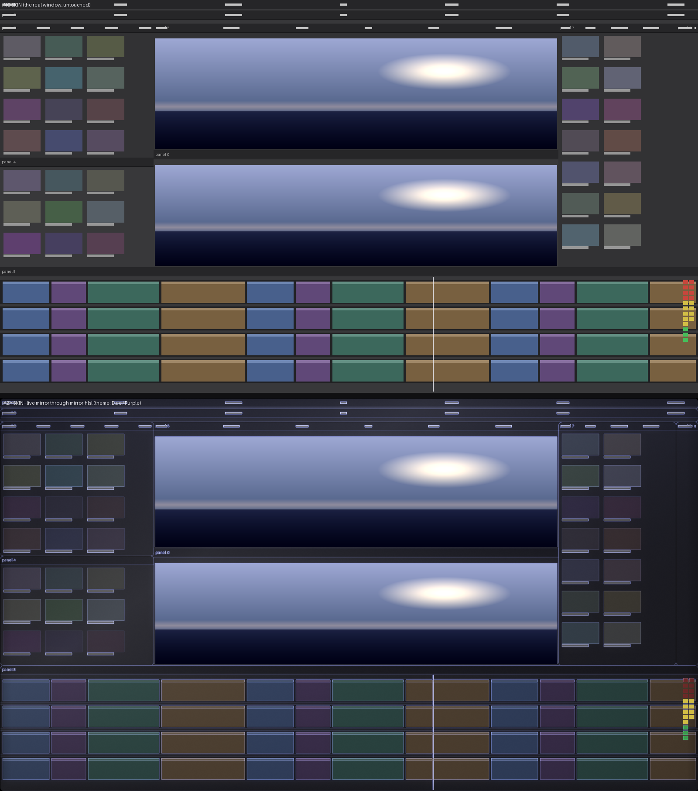
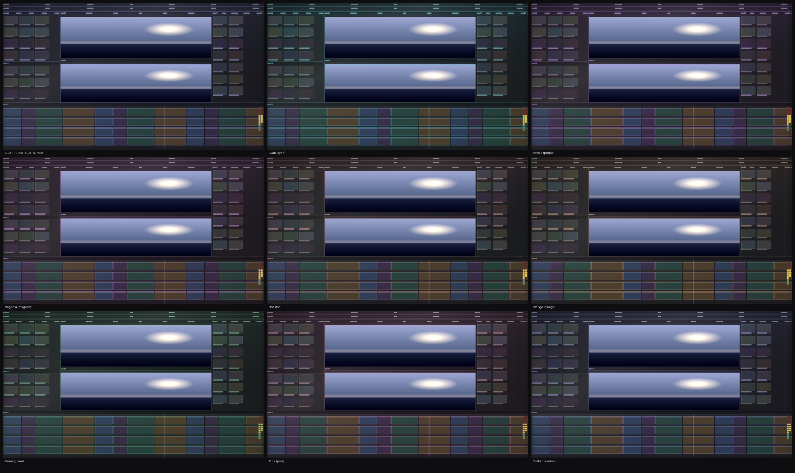

# Azy Skin

A lightweight Windows utility that gives Adobe Premiere Pro a dark, glassy,
futuristic interface — **without touching Premiere**.

Premiere Pro keeps doing exactly what it did before. Azy Skin is not a plugin, not
a panel, and not an editing tool. It is a native Win32 companion that sits in the
system tray and, while Premiere is running, **mirrors Premiere's own window on the
GPU and draws it back wearing a skin**: near-black panel surfaces, 1px lit borders,
faint reflections, a localised accent glow. The real Premiere window underneath
keeps the keyboard, the mouse, and every pixel of its behaviour.

```
“This is still Premiere Pro, but the interface looks more polished.”
```

---

## What it is (and is not)

| | |
|---|---|
| **Is** | A ~600 KB native C++/Win32 application, event-driven, no dependencies, no installer requirements, no Adobe integration |
| **Is** | A live mirror of the Premiere window: the window is captured on the GPU and drawn back skinned, so the whole interface — header, panels, timeline, meters — wears the theme, while the Program/Source Monitor pictures are passed through untouched |
| **Is not** | A UXP / CEP / ExtendScript extension, a Premiere API consumer, or a plugin of any kind |
| **Is not** | Process injection, memory patching, file patching, resource replacement, or hooking of Premiere's internals |
| **Is not** | An alternative UI, a replacement timeline or a second toolbar. The mirror carries no controls at all — it is click-through, it never takes focus, and the real Premiere window underneath stays the application you are using |
| **Never** | Takes focus, eats a click, a key, a scroll, a drag, or a shortcut |
| **Never** | Animates anything by default — the only transition in the product is an optional fade you switch on yourself |

Azy Skin does not know or care where Premiere is installed. It never opens an
Adobe file. If Azy Skin is closed, paused or crashed, Premiere is completely
unaffected — it never becomes a dependency.

---

## How it works in one paragraph

Azy identifies the Premiere process from the Windows process list (matched on the
executable *name*, never a hardcoded path) and reads its version from the
executable's version resource. It learns about everything else from Windows
notifications: process creation/deletion, window creation/destruction, moves,
resizes, minimisation, foreground changes, DPI and display changes — no polling for
position, no screenshots. Windows Graphics Capture then hands it the live pixels of
that one window on the GPU; a single shader pass rebuilds those pixels as dark
glass and presents them in a click-through window placed exactly on Premiere's
visible frame, directly in front of Premiere and never on top of anything else.
The monitor pictures inside that frame are copied through untouched, thumbnails and
previews are protected from the treatment, and everything else — panel surfaces,
separators, text, the timeline, the meters — is re-lit in the active theme. Between
events Azy does nothing; while an idle Premiere is on screen the mirror presents at
a slow, fixed rate and the same frame is not redrawn.

Detailed design: [`docs/AZY_MIRROR_ARCHITECTURE.md`](docs/AZY_MIRROR_ARCHITECTURE.md) ·
[`docs/ARCHITECTURE.md`](docs/ARCHITECTURE.md).
Every technique and why it is safe: [`docs/TECHNIQUES.md`](docs/TECHNIQUES.md).

---

## Installing

1. Run `AzySkin-2.0.0-setup.exe`.
2. Choose whether Azy Skin should start with Windows and whether it should skin
   Premiere automatically (both recommended).
3. Start Premiere Pro.

Azy Skin appears in the system tray. There is no main window, no taskbar button
and no Alt+Tab entry — that is deliberate.

**Requirements** — Windows 10 version 1809 (build 17763) or newer, 64-bit.
Premiere Pro 2024, 2025 and 2026 get the full treatment; other builds get a
conservative version of it ([details](docs/COMPATIBILITY.md)).

### Uninstalling

Settings → Apps → Azy Skin → Uninstall (or the Start menu entry). The uninstaller
removes Azy's files, its `%LOCALAPPDATA%\Azy Skin` folder and its startup entry.
It never touches Adobe folders, Premiere preferences, projects or plugins —
Premiere simply goes back to its original look.

---

## Using it

Everything lives in the tray icon (single left click toggles the skin on/off):

```
Azy Skin: active | Premiere Pro: Premiere Pro 2025 25.6.0.58
────────────────────────────────────────────────────────────────────────────────
Skin Enabled                                    ✓
Theme                ▸  Blue / Purple · Cyan · Purple · Magenta · Red · Orange ·
                        Green · Pink · Custom · Original
Settings…                                          (double-click the icon)
Start with Windows
Suspend Skin
Reload Configuration                               (after hand-editing settings.ini)
Open Log File
Restart as Administrator                           (only when Premiere runs elevated)
Exit
```

**ON / OFF is instant.** With the skin off (or with the theme set to *Original*),
the mirror window is hidden on the next message and Premiere is exactly its own.
No Premiere restart is ever needed.

### Settings window

| Group | Options |
|---|---|
| **Skin** | Enable skin · Start with Windows · Apply automatically to Premiere Pro |
| **Appearance** | Theme · Custom accent · Glass intensity · Border intensity · Corner radius · Shadow intensity · Overall darkness · Accent glow · Animate appearance |
| **Performance** | Performance mode · Suspend while minimized · Suspend while inactive |
| **Advanced** | Layout profile (Auto/Editing/Color/Audio/Effects/Graphics) · Debug mode · Re-enable features after Safe Mode · Reset configuration · Open log file |

Every change applies live — there is no OK/Apply step. Settings are stored in
`%LOCALAPPDATA%\Azy Skin\settings.ini`, which is plain INI and safe to edit by
hand (Azy notices and reloads it). See [`docs/SETTINGS.md`](docs/SETTINGS.md).

### If you cannot see the skin

The status area of the settings window reports what Azy is actually doing, on the
machine it is doing it on — including the version that is running:

```
Azy Skin 2.0.0
Premiere Pro: Premiere Pro 2025 25.6.0.58

the skin is on screen
  mirror: on screen, 81213 presents, 909 captured frames, 1920x1040, 15 fps (structural, not a pixel check: the mirror is painted by the compositor)
  lifecycle: MIRROR_ACTIVE
```

0. **Press *Check visibility*** (next to *Open log file*). It reports what is
   actually on screen — the difference between "every Windows call returned
   success" and "something is visible". Copy the text with Ctrl+C if you report a
   problem.
1. **Check the version on the first line** — it is the build you installed.
2. `the skin is NOT on screen` names the reason: waiting for Premiere, capture
   initialization failed, the window changed and Azy is reconnecting, or the
   settings say the skin is off.
3. The lifecycle line is the honest one: `WAITING_FOR_PREMIERE`, `CAPTURE_FAILED`,
   `UNSUPPORTED`, `SUSPENDED` (minimized, hidden, inactive) or `MIRROR_ACTIVE`.
   Azy never shows a placeholder rectangle while it waits — an empty state means
   nothing is drawn, not that something failed silently.
4. If it says `MIRROR_ACTIVE` and Premiere looks untouched, the theme is too
   restrained for your display: raise **Overall darkness**, **Border intensity** and
   **Accent glow** in Appearance, then dial back.
5. If Premiere Pro runs as administrator, start Azy Skin as administrator too:
   Windows does not allow a lower-integrity process to draw above a higher-integrity
   one, and Azy says so in the panel and in a tray notification.

The same facts are in `%LOCALAPPDATA%\Azy Skin\azy.log` (Settings → *Open log
file*), where `docs/TESTING.md` explains every field.

---

## The look

Azy does not put a border around Premiere: it renders Premiere's own interface as
dark glass. The base is never flat black — a near-black charcoal with depth between
surfaces — and on top of it:

* **panel surfaces** take the theme's surface colour, so panels separate by
  brightness steps rather than by outlines;
* **1px borders** re-light Premiere's own control lines, and every modelled panel
  gets a thin rounded frame with a soft interior shadow;
* **glass**: a diffusion of the pixels behind each panel, kept subtle enough that
  text stays crisp (a local-contrast term restores the detail the darkening costs);
* **accent light**: a localised glow around frames and active elements, in the
  theme's accent colour — never a screen-wide neon wash;
* **footage is untouched**: the Program and Source Monitor pictures are copied
  through exactly, and so are bright, vividly coloured regions inside panels, which
  is what keeps thumbnails and previews faithful (see the caveats in
  [`docs/AZY_MIRROR_ARCHITECTURE.md`](docs/AZY_MIRROR_ARCHITECTURE.md) §10).

Ten themes ship with it: **Blue/Purple** (default), **Cyan**, **Purple**,
**Magenta**, **Red**, **Orange**, **Green**, **Pink**, **Custom** (pick your own
accent colour) and **Original** (Azy draws nothing at all — the instant ON/OFF).
Switching a theme is instant and needs no restart; the base dark UI is the same in
every theme, only borders, glow, selection and highlights move.



*Top: the real window, untouched. Bottom: the same pixels through the skin, in the
default Blue/Purple theme. Bright monitor content, the timeline clips' colours and
the audio meters keep their own colours; the interface around them becomes glass.*



*The same frame in each theme.*

These two images are produced by `tools/preview_render.py`, which re-implements the
shader on the CPU over a synthetic Premiere picture — a picture of the maths, so the
design can be reviewed without a Windows machine. They are **not** screenshots: no
part of this repository has been run against a real Premiere yet.

---

## Performance

Azy Skin is built around *not* doing work:

* **Idle with Premiere open: 0% CPU.** No polling loop, no rendering, no work
  driven by a clock. The 1-second timer is only a safety net for a notification
  Windows failed to deliver; its normal path builds the visual key, compares it
  against the last one and returns without drawing anything.
* **Nothing happens without an event.** Window moves, resizes, minimise,
  foreground changes, DPI changes, display changes, Premiere start/stop — all
  arrive as Windows notifications. A static window produces no DWM calls, no
  repaints and no monitoring.
* **Memory: typically 6–10 MB** for the static path. No Electron, no Chromium, no
  scripting engine, no animation or UI framework: just Win32, GDI+ for one ring
  bitmap and the C++ runtime. The duplicate window adds a GPU surface the size of
  the window (a few MB of video memory) and one worker thread, and releases both
  the moment the skin is suspended or Premiere closes.
* **With the duplicate up, the cost follows the capture.** Frames are copied and
  composed on the GPU (no CPU pixel work, no screenshots, no files); pacing is 10
  frames per second while the window sits still and 30 while it is changing, and it
  is driven by the capture itself rather than by a timer that always fires. A tick
  with nothing to draw costs one flag read.
* **Never measured on a real Premiere yet.** The numbers above are budgets, not
  measurements; see [`docs/VERIFICATION.md`](docs/VERIFICATION.md) for what has
  actually been proven.
* **One paint per change, never per frame.** Azy's ring is four thin cached
  strips (top/bottom/left/right) handed to the compositor with
  `UpdateLayeredWindow`; they are only regenerated when the geometry, DPI or
  appearance actually changes. Splitting the ring keeps its bitmaps at ~280 KB on a
  1080p window (1.0 MB at 4K/200%) instead of a 33 MB window-sized layer at 4K.
* **While suspended, it is invisible.** Minimised, inactive (opt-in), dragged,
  hidden or unskinned: the surface is *hidden*, the DWM work is skipped, and no
  resources are held.

**Performance mode** goes further: flat static colours, no shadow, no
translucency, no compaction of anything expensive — designed to be the default on
lower-end machines.

Measured numbers and the method: [`docs/PERFORMANCE.md`](docs/PERFORMANCE.md).

---

## Safety and stability

| Property | How it is guaranteed |
|---|---|
| Never steals focus | Azy's surface window is created with `WS_EX_NOACTIVATE`; Azy has no focusable window at all while idle |
| Never eats input | `WS_EX_LAYERED` + `WS_EX_TRANSPARENT` (the pair that passes a click through *across processes*) + `WS_EX_TOOLWINDOW` on every window of Azy's, including the mirror; the contract is re-checked on every creation and by `tools/check-mirror.py` |
| Never takes a keystroke | No keyboard hook, no hotkey registration, nowhere in the codebase. The duplicate cannot be activated (`WS_EX_NOACTIVATE`) |
| Never captures anything but Premiere | The capture is created for the tracked window and re-validated against its owning process id before use; the *monitor* form of the capture API appears nowhere in `src/` and `tools/check-mirror.py` fails the build if it ever does |
| Never mirrors itself | Window capture, not screen capture: Azy's own windows cannot appear in the captured image, and the capture refuses to attach to Azy's own process |
| Never blocks the timeline | The surface is never larger than Premiere's own visible frame, and it is hidden the instant a move/resize loop starts |
| Never breaks on a new Premiere | Nothing about Premiere is assumed beyond "it is a window": the panel rectangles are a model, and a wrong rectangle costs a misplaced frame rather than a wrong pixel |
| Never retries forever | Repeated capture failures stop and report; **Safe Mode** keeps the skin off after repeated visual failures, with a one-line explanation and a manual way back |
| Never leaves Premiere modified | There is nothing to restore: Azy reads the window and draws its own. No DWM attribute is set, no window of Premiere's is touched, and quitting Azy leaves Premiere as it was |
| Never a dependency | Azy can be closed, paused or killed mid-session; Premiere is unaffected in every case |

The full stability and compatibility reasoning, including what is deliberately
*not* attempted and why: [`docs/LIMITATIONS.md`](docs/LIMITATIONS.md).

---

## Building from source

```powershell
# Windows (MSVC or MinGW + Windows SDK)
powershell -ExecutionPolicy Bypass -File scripts\build-windows.ps1

# then run the core unit tests
ctest --test-dir build -C Release --output-on-failure
```

```bash
# Linux/macOS: run the core tests natively and cross-compile the Windows app
# (uses the clang shipped with the `ziglang` pip package - see docs/BUILDING.md)
./scripts/verify.sh
```

Packaging: `powershell -File scripts\package.ps1` (needs Inno Setup 6) produces
`dist\AzySkin-2.0.0-setup.exe`.

Full instructions, including what the cross build can and cannot verify:
[`docs/BUILDING.md`](docs/BUILDING.md).

---

## Repository layout

```
include/azy/core/      portable logic: version, product, theme, mirror style, settings, log
include/azy/win32/     Win32 layer headers (capture, mirror, detect, os, performance, skin, ui, watch)
include/azy/app/       application layer headers
src/                   implementations, mirroring the header tree
tests/core_tests.cpp   unit tests for the portable core (no Windows needed)
packaging/             Inno Setup script + installer text
resources/             application manifest, icon, version resource
tools/make_icon.py     regenerates resources/azy_skin.ico
tools/check-includes.py  guards against include-hygiene breakage on MSVC
tools/res_to_coff.py     turns the cross build's .res into a linkable object
tools/inspect-pe.py      verifies the built executable and its resources
cmake/                 cross-compile toolchain file
scripts/               build, package and verification scripts
docs/                  architecture, techniques, compatibility, performance, testing
```

---

## Documentation

| Document | Contents |
|---|---|
| [`docs/AZY_MIRROR_ARCHITECTURE.md`](docs/AZY_MIRROR_ARCHITECTURE.md) | The mirror, end to end: capture, classification, the shader contract, window rules, synchronisation, pacing, honesty about approximation, and what is verified vs not |
| [`docs/HOW_IT_WORKS.md`](docs/HOW_IT_WORKS.md) | The whole mechanism in one page: detection, the mirror, click-through, stacking, teardown |
| [`docs/AZY_OVERLAY_ARCHITECTURE.md`](docs/AZY_OVERLAY_ARCHITECTURE.md) · [`docs/AZY_OVERLAY_TEST_PLAN.md`](docs/AZY_OVERLAY_TEST_PLAN.md) | The v1.3.0 duplicate-window design and its test plan. Historical: the ring/sheet/DWM layers it built on were removed in the 2.0.0 rebuild |
| [`docs/AZYSKIN_AUDIT.md`](docs/AZYSKIN_AUDIT.md) | The full implementation audit: what was found, what was fixed, what remains, and the readiness verdict |
| [`docs/ARCHITECTURE_REVIEW.md`](docs/ARCHITECTURE_REVIEW.md) | Second-pass review: is this the right architecture, what alternatives were rejected and why |
| [`docs/DEEP_BUG_REPORT.md`](docs/DEEP_BUG_REPORT.md) | Every defect the deep review found, with root cause, impact, fix and how it was checked |
| [`docs/RUNTIME_RISK.md`](docs/RUNTIME_RISK.md) | What cannot be verified without Premiere, the runtime simulation, and how to close the list in one session |
| [`docs/VERIFICATION.md`](docs/VERIFICATION.md) | Per feature: verified by a machine, only compiled, or unverified - and with what evidence |
| [`docs/KNOWN_LIMITATIONS.md`](docs/KNOWN_LIMITATIONS.md) | Everything Azy cannot do, does not do yet, or has not been proven to do |
| [`docs/ARCHITECTURE.md`](docs/ARCHITECTURE.md) | Modules, data flow, message routing, threading, lifecycle |
| [`docs/TECHNIQUES.md`](docs/TECHNIQUES.md) | Every Windows technique used, the safety checklist for each, and the ones deliberately rejected |
| [`docs/COMPATIBILITY.md`](docs/COMPATIBILITY.md) | Premiere versions, Windows builds, DPI and multi-monitor behaviour, safe fallbacks |
| [`docs/LIMITATIONS.md`](docs/LIMITATIONS.md) | What cannot be restyled from outside Premiere, and why Azy refuses to force it |
| [`docs/FEASIBILITY.md`](docs/FEASIBILITY.md) | What Premiere's UI actually is, region by region, and which visual techniques reach it |
| [`docs/PROGRESS.md`](docs/PROGRESS.md) · [`docs/progress.html`](docs/progress.html) | Where the implementation stands against the full specification, with per-phase estimates |
| [`docs/PERFORMANCE.md`](docs/PERFORMANCE.md) | CPU/memory/GPU budget, what is done to meet it, how to measure it |
| [`docs/TESTING.md`](docs/TESTING.md) | The manual test matrix (window states, DPI, multi-monitor, editing interactions, failure cases) |
| [`docs/SETTINGS.md`](docs/SETTINGS.md) | Every configuration key, its range and its default |
| [`docs/BUILDING.md`](docs/BUILDING.md) | Toolchains, cross-compilation, packaging, CI |
| [`CHANGELOG.md`](CHANGELOG.md) | Release history |

---

## Principles

1. **Make Premiere look better, not work differently.** Functionality is never
   touched — no shortcuts, no panels, no workflows, no editing behaviour.
2. **Performance first.** If a visual idea costs CPU while nothing is happening,
   it does not ship.
3. **Least invasive technique that achieves the effect.** Documented Windows
   composition, not clever tricks.
4. **Static and subtle.** No animation is a feature, not a limitation.
5. **Graceful degradation.** Anything that cannot be done safely is skipped,
   reported once, and the skin falls back — never escalated.

---

## Legal

MIT licensed ([`LICENSE`](LICENSE)). Azy Skin is an independent utility, not
affiliated with or endorsed by Adobe. Adobe and Adobe Premiere Pro are trademarks
of Adobe Inc. Azy Skin contains, modifies and redistributes no Adobe code,
resource or file.
